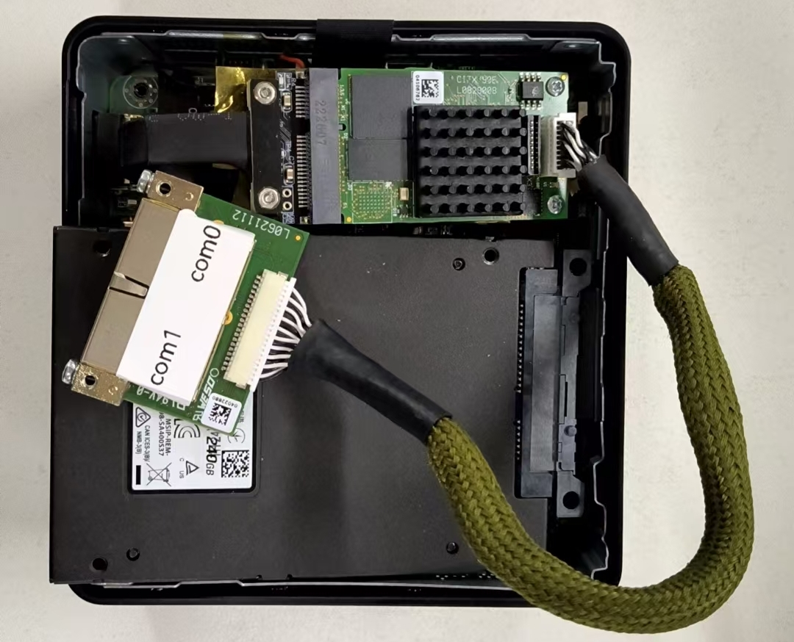

# Hilscher-Ethercat-Master
An EtherCAT Master based on Hilscher CIFX 90E-RE\F board for elmo gold series drive, and also 
supportting for other EtherCAT device. 
This project is in updating...

## Overview

**CIFX 90E-RE\F** board is a powerful PC cards in all formats for all protocols, you can directly conncect it to your PC via mini PCIe or other interfaces(PCIE, M.2, etc.) depending on the specific product. 

The cifX PC card family is the unified standard supporting all Real-Time Ethernet and Fieldbus systems for PC-based automation.

The protocol stack is executed autonomously on the PC card and process data is exchanged with the host via Dual-Port-Memory or DMA (Direct Memory Access). Due to the common Hilscher Platform Strategy, all PC cards use the same driver and tools - irrespective of protocol and card format. The Hilscher netX technology makes it possible to realize all Real-Time Ethernet protocols with one single hardware. A communication protocol can be changed by loading a different firmware.

Always the right solution! Different cable lengths, M-12 connectors, additional NVRAM, extended temperature range, 2-channel cards, or detached network interfaces – numerous hardware options always offer the optimum solution for your application. Moreover, a wide range of device drivers as well as a C-Toolkit, which is free of charge, are available.

The specific parameters of CIFX 90E-RE\F are shown below.
| **Category**                        | **Details**                                                                                   |
|-------------------------------------|-----------------------------------------------------------------------------------------------|
| **Product Name**                    | CIFX 90E-RE\F                                                                                |
| **Part Number**                     | 1291.100                                                                                     |
| **Brief Description**               | PC Card cifX Mini PCI Express for Real-Time Ethernet Master or Slave - with cable connector Ethernet for Ethernet assembly interface (AIFX-RE) |
| **Function**                        | Communication Interface with Mini PCI Express and Ethernet interface                         |
| **Communication Controller**        | netX 100                                                                                     |
| **Integrated Memory (RAM)**         | 8 MB SDRAM                                                                                   |
| **Integrated Memory (FLASH)**       | 4 MB serial Flash EPROM                                                                      |
| **Supply Voltage**                  | +3.3 V DC ±5%                                                                                |
| **Maximum Current (Typical)**       | 800 mA (at 3.3 V)                                                                            |
| **Connector (Power Supply)**        | Via Mini PCI Express Bus                                                                     |
| **Bus Type**                        | Mini PCI Express, One Lane Port                                                              |
| **Data Access**                     | DPM or DMA (Direct Memory Access), from hardware revision A                                  |
| **Dual-Port Memory Size**           | 64 KB                                                                                        |
| **Data Width**                      | 32 bit                                                                                       |
| **Transmission Rate**               | 33 MHz                                                                                       |
| **Communication Standard**          | Ethernet                                                                                     |
| **Interface Type**                  | 10BASE-T/100BASE-TX, isolated                                                                |
| **Auto Negotiation**                | Depending on loaded firmware                                                                 |
| **Auto Crossover**                  | Depending on loaded firmware                                                                 |
| **Connector (Communication)**       | Cable Connector Ethernet X4 (JST BM20B-SRDS-G-TFC, pitch 1.0 mm) to connect an Ethernet Assembly Interface AIFX-RE |
| **LED Display**                     | SYS, System Status LED                                                                       |
| **Operating Temperature Range**     | 0 °C ... +55 °C (Air flow during measurement: 0.5 m/s)                                       |
| **Storage Temperature Range**       | -40 °C ... +85 °C                                                                            |
| **Humidity**                        | 10 % ... 95 % relative humidity, no condensation permitted                                   |
| **Environment**                     | For UL compliant usage: The device must be used in a pollution degree 2 environment.         |
| **Altitude**                        | 0 m ... 2000 m                                                                               |
| **Dimensions (L x W x H)**          | 51 mm x 30.2 ± 0.1 mm x 11 mm                                                                |
| **Mounting/Installation**           | PCI Express Mini System Connector (3.3 V), X1/X2 = One-Lane                                  |
| **Configuration Software (Master and slave)** | **SYCON\.net**                                                                                    |
| **Configuration Software (Slave)**  | netX Configuration Tool                                                                      |

The CIFX card also supports many other protocols:
 

For more information, please refer to the official website of Hilscher: [Products](https://www.hilscher.com/products/pc-cards-for-industrial-ethernet-fieldbus/mini-pci-express/cifx-90e-ref) and [Solutions](https://hilscher.atlassian.net/wiki/spaces/COMSOLDVD/pages/256540711/Download+package+Communication+Solutions+2023-07-1).

### Starup
Here we go, please refer the following step by step to get the communication works.
#### 1.Hardware Connection
For CIFX 90E-RE\F board, the communication is realized through mini PCIe(refer to this for [PCIe](https://www.cnblogs.com/wsg1100/p/17481819.html)).
We tested it on two platforms:

**AAEON PICO-TGU4**
You can directly connect the cifx board to this computer via mini PCI-e.
{width=400}  {width=360}
**Intel NUC**
You need to select the cifx board with M.2 interface or using M.2 to mini PCI-e Adapter Cable.
{width=400} &nbsp;&nbsp;&nbsp; {width=326}

#### 2.Linux Driver installation and building
For Linux Driver installation, please refer to the [nxdrvlinux](https://github.com/crown133/nxdrvlinux/tree/5571118249232441bb86f5a7e55a090895a45df1).

#### 3.Connecting the CIFX card in a Linux System to SYCON\.net software via TCP Server
During commissioning of a CIFX Card in a Linux System, it is required to Download a Firmware and Configuration to the CIFX Card.

This can be either done by exporting these files from Sycon\.net on a Windows System to the driver directory of the Linux system or by connecting directly to the CIFX Card via a TCP Server.

The Software Sycon\.net which is used to create a configuration for CIFX Cards (except netX 90 based CIFX Cards, which use Communication Studio), is unfortunately only compatible with Windows.

Using the TCP Server has a lot of benefits. It guarantees that the Firmware and Configuration files will directly be copied to the right directory and it will also provide access to the protocol diagnosis. This also makes protocol troubleshooting much easier.

{width=500}
*System overview Cifx and remote connection via ethernet.*

##### Driver installation and Network settings
To follow this application note, please make sure that the Step 2 are already finished. 
- The CIFX Device Driver for Linux needs to be installed on the Linux System (please follow the instructions provided in the manuals of **nxdrvlinux**). 
- The **nxdrvlinux** includes a standalone TCP/IP server example (cifXTCPServer), offering access to a remote system with an installed CIFX hardware.The example can be found in the examples directory of the [nxdrvlinux](https://github.com/crown133/nxdrvlinux/tree/5571118249232441bb86f5a7e55a090895a45df1).
  
- Connect the network adapter on your Linux PC, with a network adapter of a Windows PC.
    - **Please use a fixed IP address in the same subnet for both network adapters.**
  
- Install the latest version of [Sycon.net](https://hilscher.atlassian.net/wiki/display/SYCON/) on your Windows system.(Recommend the newest V1 version of [Syscon.net](https://hilscher.atlassian.net/wiki/spaces/SYCON/pages/1080164381/V1.0500.241112.50692) software)

##### Start the TCP Server Application
Please start the TCP Server application on your Linux System.

The Output Window of the TCP Server will show the following (It is important that the CIFX Card is shown under the "now accessible" devices. In this example cifX0 is accessible):
```bash
$ sudo ./cifxtcpserver
cifXDriverInit...
Press ctrl+'c' to quit!
 
******************************************************************************
The following card(s) are now accessible via TCP/IP remote connection:
1.: cifX0
 
The server is reachable under:
Interface Name  : IP
---------------------------
eth0            : 10.13.5.77
docker0         : 10.252.254.1
 
******************************************************************************
```
It also shows the IP address, with which the CIFX card can be accessed.

For the following Step, referring here:
[Reference](https://hilscher.atlassian.net/wiki/spaces/GLOBALSUP/pages/122801079/How+to+connect+a+CIFX+Card+in+a+Linux+System+to+Sycon.net+via+TCP+Server)


#### 4.Configuration on SYCON\.net 
You can refer [this](documents/HK-CIFX板卡作为EtherCAT主站的基本使用举例_V1.2.pdf).

##### Adding the Slave's ESI File into SYSCON\.net 
Adding the [Elmo](<EtherCAT firmware&ESI/ESI/Elmo ECAT 00010420 V11.xml>) and [Beckoff CU1128 Switch](<EtherCAT firmware&ESI/ESI/Beckhoff CUxxxx.xml>) slave information files into SYSCON\.net for bus scanning.
{width=660}

##### Firmware Downloading
After connecting to the cifx card via tcp server, you should download the [EtherCAT firmware](<EtherCAT firmware&ESI/cifX/cifxecm.nxf>) firstly.

{width=660}

##### Scan for Slaves
{width=660}

{width=660}

{width=600}

##### General Setting
{width=660}

##### Slave Process Data Setting
Make sure the process data setting is the same with the **PdoTypeEnum** in host application code strictly (For example the [RxPdo](cifx-ros2/src/ethercat_master/elmo_ethercat_sdk/include/elmo_ethercat_sdk/RxPdo.hpp) and [TxPdo](cifx-ros2/src/ethercat_master/elmo_ethercat_sdk/include/elmo_ethercat_sdk/TxPdo.hpp)).
**Otherwise the addressing in I/O data will be in wrong order.**

{width=660}

The final address table is shown below:
{width=660}

##### Downloading the setting into CIFX card
Downloading the configuration into CIFX card after finished.

